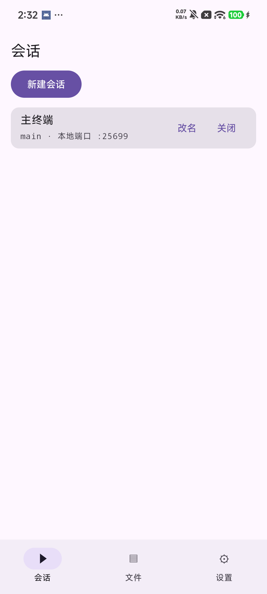
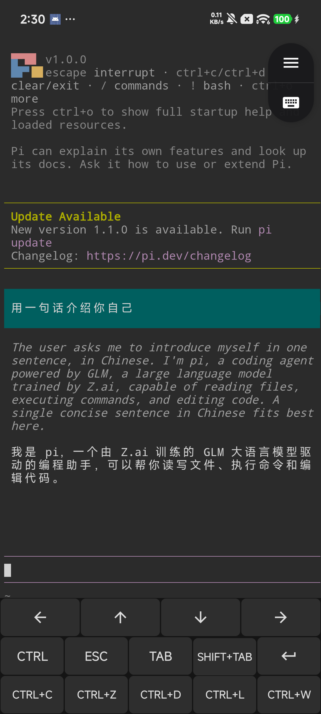

# Drydock

运行在安卓系统上的 coding agent 宿主（host）：免 root 的本地 Linux 环境 + agent 任务调度

## 使用说明

界面支持中文与英文：跟随系统语言自动切换（中文系统显示中文，其余显示英文）；Android 13+ 也可在系统设置里单独指定 Drydock 的语言。

### 安装

从 [Releases](https://github.com/Luan-Fuzi/drydock/releases) 下载最新 APK 安装。要求 arm64 设备、Android 10+，安装时允许未知来源。

自行构建：JDK 17 + Android SDK，执行 `./gradlew assembleDebug`，产物在 `app/build/outputs/apk/debug/`。CI 在每次 push 到 main/dev 时构建 APK 并上传 artifact，也可从 Actions 页取包。

### 简单操作

| 主页 | 终端（与 pi 对话） |
| --- | --- |
|  |  |

- 主页「新建会话」：首次使用时自动部署环境（下载并配置 Ubuntu rootfs，需联网），完成后进入终端。
- 终端页右上角浮钮：上半格打开会话菜单（切换 / 新建 / 回主页），下半格展开虚拟键条（方向键、Esc / Tab、Ctrl 与 Ctrl+C 等组合键）。
- 终端内直接运行 agent CLI；锁屏后任务继续运行，重新打开后接回原会话。
- 文件页浏览环境内文件，支持导出（落到系统 Downloads/Drydock）、重命名、删除。

### 开始使用

实测支持三个 agent ：OpenCode、pi、DeepSeek Harness。向导默认勾选 OpenCode，pi 与 DSH 按需勾选；安装走 npm（默认国内镜像）。也可以跳过向导，在终端内自行安装任意 CLI agent。

### 配置 AI 端点

- 向导或设置页选择常见厂商（DeepSeek / OpenAI / 智谱 GLM / Anthropic 等）并填入 API key：按该厂商的标准环境变量名写入 `~/.drydock/env.sh`，OpenCode / pi 按内置目录自动识别。
- 自定义端点（OpenAI 兼容 / Anthropic Messages 协议，含 baseURL 与模型名）在设置页「自定义端点」添加。

配置对新会话生效；已打开的终端执行 `. ~/.drydock/env.sh` 可立即生效。

## 原理说明

### 核心原理

- **proot 系统调用翻译**：通过 ptrace 拦截并翻译系统调用与文件路径，在无 root 权限下呈现完整的 Linux 文件系统（默认 Ubuntu 24.04 LTS arm64 rootfs，首次使用时下载）。引擎为 Termux 维护的 proot fork，以二进制随 APK 分发（GPL，源码重建见 `scripts/build-proot.sh`）。
- **终端链路**：环境内运行 ttyd 提供 Web 终端，宿主用 WebView 渲染 xterm.js；dtach 把会话挂在 Unix socket 上——页面关闭或进程退出后，会话及其中的运行状态不丢失。
- **存活保障**：前台服务与 WakeLock 维持锁屏期间的 CPU 与进程存活；rootfs、会话注册表持久化于应用私有目录。

### 补充说明

- **不保管密钥**：API key 以明文存于环境内 `~/.drydock/env.sh`（与 `~/.ssh` 同形态），由使用者自行写入与保管；宿主不做加密存储或密钥托管。
- **proot 的已知局限**：系统调用翻译有开销——CPU 约 -7~10%，npm install 等 I/O 密集场景慢 2–5 倍，日常交互无感；部分多进程工具不兼容——tmux 的 daemon 化在 ptrace 追踪下会卡死，会话持久化因此采用 dtach；npm 安装的带原生二进制的包在升级时可能触发符号链接断链（可从镜像源重建修复）。
- **终端优先**：宿主不做对话包装层，agent 以原生 TUI 运行，GUI 只承担环境与会话管理。
- rootfs 及 apt / npm 安装的软件在运行时从各发行方镜像下载，不随仓库分发，许可证随发行物（仓库内置组件见 [NOTICE.md](NOTICE.md)）。

## 仓库结构

| 路径                   | 内容                                                                                                                    |
| ---------------------- | ----------------------------------------------------------------------------------------------------------------------- |
| `app/`               | 宿主 Android 应用（Kotlin，原生 View 体系）；`jniLibs/` 为 proot 引擎二进制（GPL，重建见 `scripts/build-proot.sh`） |
| `scripts/`           | 验收与仪器：夜批全链回归（night-b.py）、CDP 驱动、各判据脚本、proot 交叉编译                                            |
| `docs/`              | 项目文档                                                                                                                |
| `.github/workflows/` | CI：assembleDebug + jniLibs 引擎断言 + artifact 上传                                                                    |

## 致谢

- 感谢 [GLM 5.3](https://chatglm.cn) 与 GLM 5.3 Flash：本项目的绝大部分代码由它们编写。
- 感谢 [Termux](https://termux.dev) 及其社区：免 root Linux 方案的技术基座与灵感来源，proot 引擎采用 Termux 维护的 fork。
- 感谢 [OpenCode](https://opencode.ai)、[pi](https://github.com/earendil-works/pi)、DeepSeek Harness 等开源 agent 项目。

